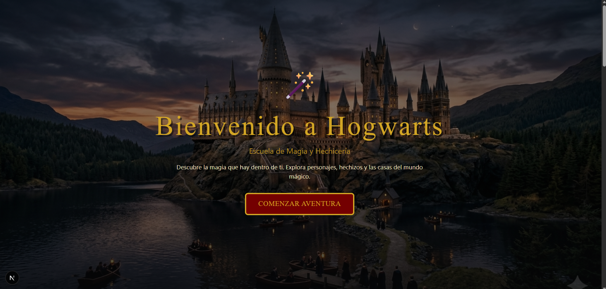
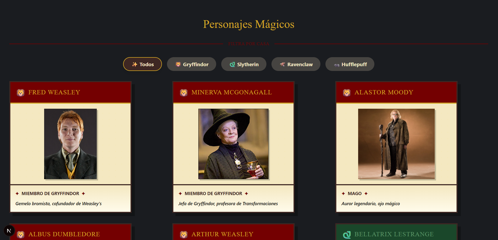
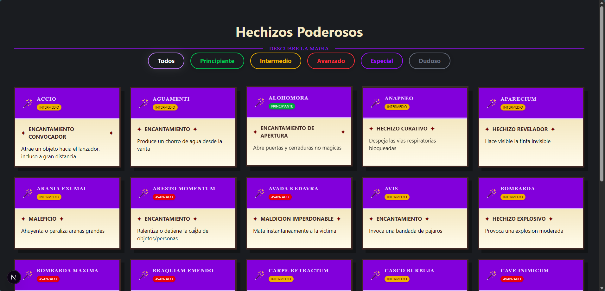
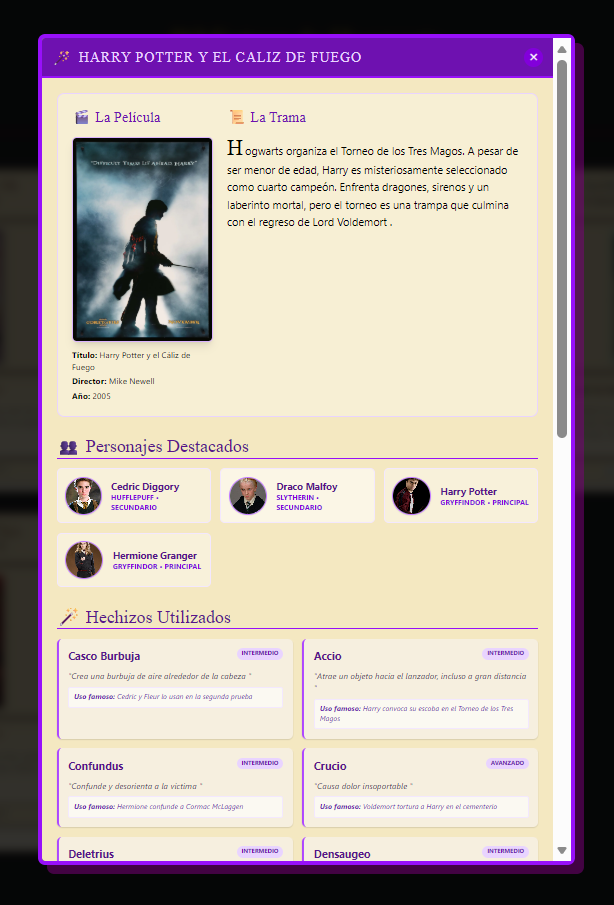

# ⚡ Harry Potter - Hogwarts Experience

¡Bienvenido al Mundo Mágico! Este proyecto es una aplicación web dinámica inspirada en el universo de Harry Potter, diseñada para explorar personajes, hechizos, libros y las emblemáticas casas de Hogwarts.

Este proyecto fue desarrollado como una **práctica avanzada de integración con Supabase**, enfocándose en el manejo de bases de datos relacionales, autenticación y renderizado del lado del servidor (SSR) con Next.js.

---

## 📸 Galería de la Academia

A continuación, se presentan algunas capturas de pantalla que muestran la interfaz y funcionalidades del proyecto:

### 🏰 Inicio y Navegación

*Explora el Gran Comedor y comienza tu aventura mágica.*

### 🧙‍♂️ Personajes y Hechizos
<p align="center">
  
  
</p>
*Listado completo de magos y catálogo de encantamientos.*

### 📚 Biblioteca y Detalles
<p align="center">
  
  
</p>
*Consulta la colección de libros y sus detalles mágicos.*

---

## 🚀 Características Principales

- **🧙‍♂️ Gestión de Personajes**: Base de datos completa con detalles como casa, sangre, patronus y más.
- **✨ Catálogo de Hechizos**: Filtrado por niveles (Principiante, Intermedio, Avanzado, Especial).
- **🏰 Las Cuatro Casas**: Secciones dedicadas a Gryffindor, Slytherin, Hufflepuff y Ravenclaw con estilos personalizados.
- **📖 Biblioteca Mágica**: Carrusel de libros con descripciones detalladas.
- **🔐 Sistema de Autenticación**: Registro e inicio de sesión integrados con Supabase Auth.
- **📱 Diseño Responsivo**: Interfaz optimizada para todos los dispositivos con una estética "Gothic-Magic".

---

## 🎨 Sistema de Diseño: "Gothic-Magic"

La aplicación utiliza un sistema de diseño personalizado que combina la estética gótica con elementos modernos:

- **Paleta de Colores**: Basada en las casas de Hogwarts (Gryffindor, Slytherin, Hufflepuff, Ravenclaw) con tonos pergamino y madera.
- **Tipografía**: Uso de fuentes temáticas (Harry Potter font) para títulos y encabezados.
- **Componentes Custom**:
  - **Modales Mágicos**: Transiciones suaves y bordes decorativos.
  - **Cartas Dinámicas**: Efectos de hover y sombras proyectadas que dan profundidad.
  - **Hydration Optimized**: El código ha sido optimizado para evitar errores de hidratación mediante la normalización de clases y el manejo cuidadoso de estados en el servidor.

---

## 🛠️ Stack Tecnológico

- **Framework**: [Next.js](https://nextjs.org/) (App Router + SSR)
- **Base de Datos**: [Supabase](https://supabase.com/) (PostgreSQL)
- **Autenticación**: Supabase Auth
- **Estilos**: [Tailwind CSS](https://tailwindcss.com/)
- **Iconografía**: Lucide React
- **Componentes UI**: Custom built (Hero, Cards, Modals, Carousels)

---

## 📡 Integración con Supabase

El corazón de este proyecto reside en su comunicación con **Supabase**. Se implementaron los siguientes flujos:

1. **Lectura de Datos (CRUD)**:
   - Los datos se obtienen de forma asíncrona utilizando `Promise.all` para optimizar el tiempo de carga.
   - Tablas utilizadas: `personajes`, `hechizos`, `casas`, `libros`.
2. **SSR & Client Components**:
   - Uso de `createClient` en el servidor para el primer renderizado.
   - `use client` en componentes interactivos como modales y carruseles.
3. **Manejo de Imágenes**: Las imágenes están alojadas en el **Supabase Storage**, permitiendo una carga rápida y eficiente.

```javascript
// Ejemplo de llamada a la base de datos
const [personajesRes, hechizosRes] = await Promise.all([
  supabase.from('personajes').select('*'),
  supabase.from('hechizos').select('*')
]);
```

---

## 📂 Estructura del Proyecto

```text
src/
├── app/                  # Rutas y páginas de la aplicación
│   ├── (paginas)/        # Secciones específicas (hechizos, personajes, etc.)
│   ├── layout.js         # Layout principal con Navbar y Footer
│   └── page.js           # Página de inicio con SSR
├── components/           # Componentes reutilizables
│   └── ui/               # Componentes de interfaz (Button, Card, Modal)
├── utils/                # Utilidades de Supabase
│   └── supabase/         # Clientes de servidor, cliente y middleware
└── assets/               # Capturas de pantalla y recursos visuales
```

---

## ⚙️ Configuración e Instalación

1. **Clonar el repositorio:**
   ```bash
   git clone https://github.com/tu-usuario/harry-potter.git
   ```

2. **Instalar dependencias:**
   ```bash
   npm install
   ```

3. **Configurar variables de entorno:**
   Crea un archivo `.env.local` con tus credenciales de Supabase:
   ```env
   NEXT_PUBLIC_SUPABASE_URL=tu_url_de_supabase
   NEXT_PUBLIC_SUPABASE_ANON_KEY=tu_anon_key
   ```

4. **Ejecutar en desarrollo:**
   ```bash
   npm run dev
   ```

---

## 🖋️ Créditos

Este proyecto fue desarrollado como parte de un entrenamiento intensivo en desarrollo web moderno, explorando la sinergia entre **Next.js** y **BaaS (Backend as a Service)** como Supabase.

*Realizado con ❤️ y un poco de magia por Daniel.*
